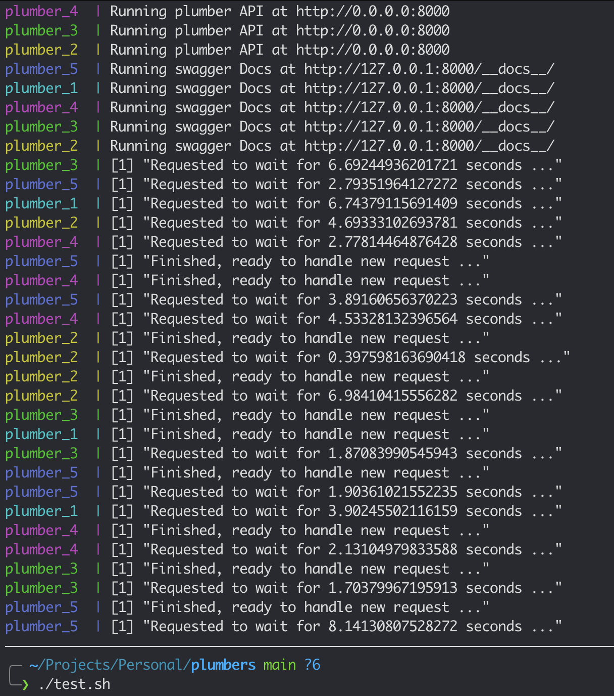

# Plumbers

Example on how to easily scale your plumber API using docker-compose and
traefik.

## Requirements

- docker
- docker-compose

## Setup

Run `docker-compose up --scale 5` in the main directory

## Testing 

While seeing logs from the previouse command, run in the separate bash session
`./test.sh`. This will invoke 20 concurrent requests that will be handled by 5
containers in this example. Some will be handled instantly, the other 15 will
have to wait, but will be executed. You can try to parse `--scale 20` and all
requests will be handled immediately.

